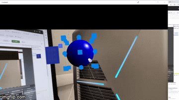

# WebXR-BabylonJS-examples

This repository contains some examples of extended reality applications made using WebXR and BABYLON.js

## MRTK Usage example

This example show how the merk element can be used with Babylon.js for jenerating WebXR app.



## Piano example

This example refers to the piano tutorial available in the Microsoft documentation concerning the usage of WebXR.

Further information can be found at the following link: [MRT tutorial](https://learn.microsoft.com/en-us/windows/mixed-reality/develop/javascript/tutorials/babylonjs-webxr-piano/introduction-01)

## SimpleCì Cube Interaction example

This example refers to the tutorial available in the Microsoft documentation concerning the usage of WebXR.

Further information can be found at the following link: [MRT tutorial](https://learn.microsoft.com/en-us/windows/mixed-reality/develop/javascript/tutorials/babylonjs-webxr-helloworld/introduction-01)

## How to run the examples

Since WebXR only works on secure sites (https) or localhost, in order to launch the application with a specific IP address, you must associate a certificate to the web page. To do this you can use openssl and execute the following commands in the application directory:

```shell
openssl genrsa -out private_key.pem
```

```shell
openssl req -new -key private_key.pem -out csr.pem
```

```shell
openssl x509 -req -days 9999 -in csr.pem -signkey private_key.pem -out cert.pem
```

Once you have created the certificate you can launch the application by running the following commands:

```shell
npm install
```

```shell
node app.js
```